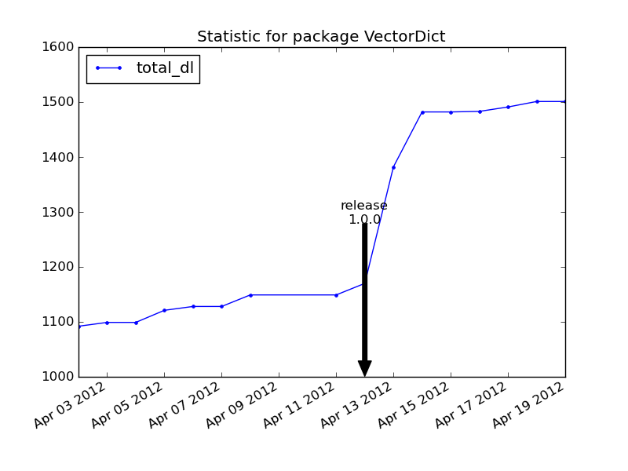

.. pypi-stat documentation master file, created by
   sphinx-quickstart on Wed Apr 18 14:48:57 2012.
   You can adapt this file completely to your liking, but it should at least
   contain the root `toctree` directive.

References : 
============

* source : https://github.com/jul/pypi-stat/
* online documentation : http://pypi-stat.readthedocs.org/
* ticketing : https://github.com/jul/pypi-stat/issues

Synopsis
========

Pypi offers an xmlrpc service that can gives you once a day the download stats 
for your package.  The problem is that for ploting a time serie you need the 
past datas. This package is made of two scripts : 

* one to gather the data and store them in json format ;
* one to plot the results as a time serie.

pypi_get_stat to fetch data
***************************

Stats are fetched on pypi. It is based on http://www.codekoala.com/blog/2010/pypi-download-stats/

This scripts add to the original the usage and storing previous stats in ``~/.pypi.stat.json``

pypi_graph_stat to plot the stats
*********************************

Based on the stored stats, use matplotlib : 
 * either to make a plot in matplotlib (it should pop a TK window with the graph);
 * or print a plot in a mentioned file.

It has limited query feature : 
 * date interval can be specified ;
 * package to plot ;
 * keys in the fetched stat to plot (total download, average download, minimum download per release, maximum download per release);
 * release dates are added;

Example
=======

QuickStart
==========

Install following :ref:`installation`

get stats for a package (here we want download stats for numpy). 

 ``pypi_get_stat.py numpy``

graph all known packages in the stored stats.
 
 ``pypi_graph_stat.py``

Using pypi-stat
===============

Contents:

.. toctree::
    installation
    usage
    new

Indices and tables
==================

* :ref:`genindex`
* :ref:`modindex`
* :ref:`search`

