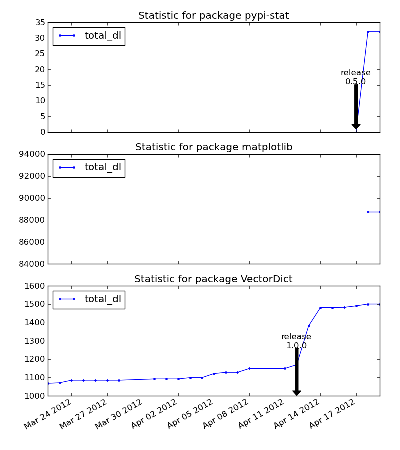
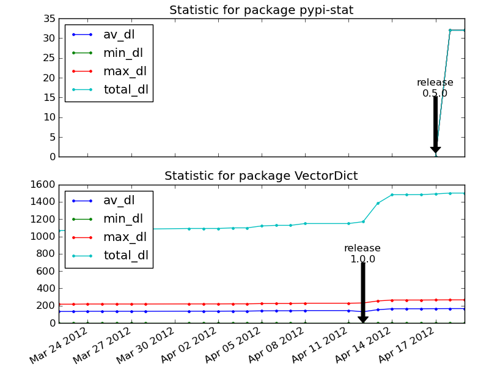
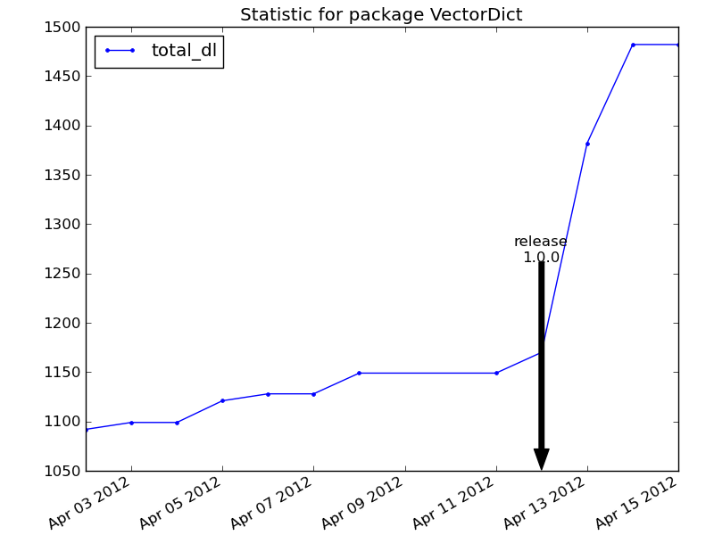

pypi_get_stat usage :
=====================

.. literalinclude::
    inc/pypi_get_stat.rst

Fetching sepcific data for packages 
***********************************

    pypi_get_stat.py -p numpy -p matplotlib

will fectch, store and print the data for the packages numpy and matplotlib

Fetching all data for already known package
*******************************************

If you made the previous call successfully fetching all data for numpy and matplotlib will be made by calling
    
    pypi_get_stat.py

pypi_graph_stat usage :
=======================

.. literalinclude::
    inc/pypi_grah_stat.rst

Graphing for a package with a direct output in tk
*************************************************

``pypi_graph_stat.py -p VectorDict``

Result : 

..  image:: image/sample1.png

Graphing all known package in a file
************************************

 pypi_graph_stat.py -o docs/source/image/sample2.png

Graphing all keys for two packages
**********************************

 pypi_graph_stat.py -k av_dl -k min_dl -k max_dl -k total_dl -p VectorDict -p pypi-stat

Graphing between two dates
**************************

 pypi_graph_stat.py -f 2012-04-01 -t 2012-04-15 -p VectorDict 

